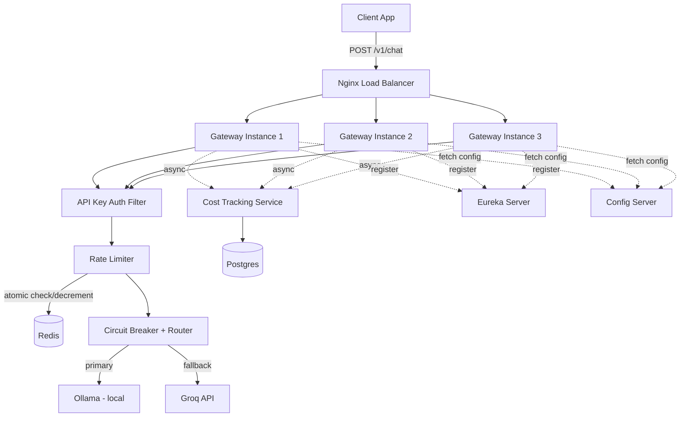
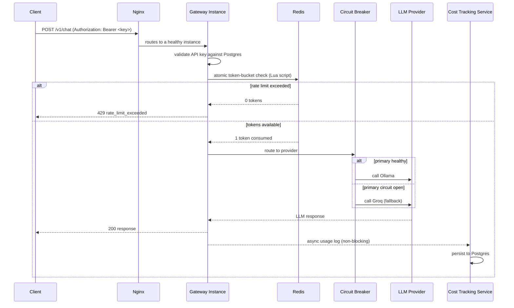

# Distributed AI Gateway

A distributed, rate-limited API gateway sitting in front of multiple LLM providers (Ollama, Groq), giving internal services one endpoint with automatic failover, per-client rate limiting, and centralized cost tracking — modeled on production tools like Portkey, Kong AI Gateway, and Cloudflare AI Gateway.

## Architecture



## Request Flow



## Tech Stack

| Layer | Technology |
|---|---|
| Language / Framework | Java 21, Spring Boot 4.x |
| API Gateway | Spring Web, custom rate limiter & routing logic |
| Auth | Spring Security, SHA-256 hashed API keys |
| Rate Limiting | Redis + hand-written atomic Lua script (token bucket) |
| Resilience | Resilience4j (circuit breaker) |
| Service Discovery | Netflix Eureka |
| Centralized Config | Spring Cloud Config Server |
| Database | Postgres (API keys, usage logs) |
| LLM Providers | Ollama (local, free), Groq (cloud, free tier) |
| Containerization | Docker, Docker Compose |
| Load Balancing | Nginx |
| Load Testing | k6 |

## Setup

**Prerequisites:** Docker + Docker Compose, [Ollama](https://ollama.com) running locally with `llama3.2:1b` pulled, a free [Groq](https://console.groq.com) API key.

```bash
cp .env.example .env
# edit .env, set GROQ_API_KEY

docker-compose up --build
```

- Eureka dashboard: http://localhost:8761
- Gateway (via Nginx): http://localhost

**Generate an API key:**
```bash
curl -X POST http://localhost/admin/keys \
  -H "Content-Type: application/json" \
  -d '{"clientName": "demo-client", "rateLimitCapacity": 5}'
```

**Send a chat request:**
```bash
curl -X POST http://localhost/v1/chat \
  -H "Content-Type: application/json" \
  -H "Authorization: Bearer <your-api-key>" \
  -d '{"prompt": "say hello in 5 words"}'
```

See `demo.sh` for the full scripted walkthrough.

## What This Demonstrates

- **Distributed rate limiting** — Redis-backed, atomically-updated token bucket that stays correct across multiple gateway instances (proven with k6 load testing)
- **Automatic failover** — Ollama unavailable → transparent fallback to Groq, zero client-visible errors
- **Circuit breaking** — repeated failures trip a circuit breaker; subsequent requests fail fast instead of waiting out real timeouts
- **Service discovery** — services register with Eureka and locate each other by name, not hardcoded URLs
- **Centralized configuration** — provider URLs, rate limits, circuit breaker thresholds live in Config Server
- **Real authentication** — SHA-256 hashed API keys checked against Postgres per request

## Known Limitations / Production Considerations

| Gap | What production would need |
|---|---|
| No HTTPS/TLS | TLS termination at the load balancer |
| No secrets manager | API keys/passwords are env vars; production needs AWS Secrets Manager / Vault |
| No key rotation/expiry | Keys are valid indefinitely once issued |
| No centralized logging | Each service logs locally; production needs ELK/CloudWatch |
| No metrics/monitoring | No dashboards for request rate, error rate, circuit state; needs Prometheus + Grafana |
| No distributed tracing | Can't trace one request across services; needs Zipkin/Jaeger |
| No DB migrations tool | Relies on Hibernate `ddl-auto`, not Flyway/Liquibase |
| Single Postgres/Redis instance | No replication or failover for the data layer |
| No admin endpoint auth | `/admin/keys` is open; production would lock this down |
| Docker Compose, not Kubernetes | No rolling deploys or autoscaling |
| No CI/CD pipeline | No automated build/test/deploy |

These are deliberate scoping decisions for a project meant to demonstrate distributed-systems fundamentals, not oversights.

## Project Structure

```
distributed-ai-gateway/
├── gateway-service/          # Auth, rate limiting, routing (3 instances)
├── cost-tracking-service/    # Usage logging + querying
├── eureka-server/            # Service registry
├── config-server/            # Centralized configuration
├── config-repo/              # Config files served by Config Server
├── nginx/                    # Load balancer config
├── load-test/                # k6 load testing scripts
├── docker-compose.yml
├── demo.sh
└── .env.example
```
